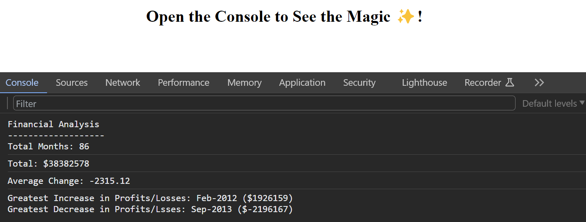

# Console Finances Analyser

## Deployed Website Link
https://digitallyalex.github.io/console-finances/

## Description
This project was created to analyse the financial records of a company using JavaScript, and showcase them in the Console Log.

This was a challenging, yet rewarding exercise that further strengthened my initial knowledge of JavaScript variables, for loops and arrays, in combination with mathematical problems.

## Installation
N/A

## Usage
This web application provides an analysis of the financial data for a private company. 

By opening the Console Log, users can see:
- The total number of months analysed,
- The average month-to-month change in revenue,
- The month with the greatest increase in revenue, together with the change amount, and
- The month with the greatest decrease in revenue, together with the change amount.

If you encounter any errors or issues with this application, please let me know.

## Credits
Overall instruction and provision of necessary materials for this project from the EdX Front-End Web Development Bootcamp instructor and teaching assistants (Oct2023 Cohort).

Additionally, a few resources and tutorials were very helpful in guiding me towards the completion of this task and learning JavaScript over the past week overall:

- On JS Variables: https://javascript.info/variables
- On JS Conditional Branching: https://javascript.info/ifelse
- On JS Loops: https://javascript.info/while-for
- On Calculating array sums: https://www.educative.io/answers/how-to-get-the-sum-of-an-array-in-javascript
- ChatGPT, for clear, broken-down explanations on the concepts of for loops and arrays: https://chat.openai.com/

Badges at the bottom of this README file were listed with the help of the following repository: https://github.com/Ileriayo/markdown-badges

## License
MIT License

Copyright (c) 2023 Alexandra Asanache

Permission is hereby granted, free of charge, to any person obtaining a copy of this software and associated documentation files (the "Software"), to deal in the Software without restriction, including without limitation the rights to use, copy, modify, merge, publish, distribute, sublicense, and/or sell copies of the Software, and to permit persons to whom the Software is furnished to do so, subject to the following conditions:

The above copyright notice and this permission notice shall be included in all copies or substantial portions of the Software.

THE SOFTWARE IS PROVIDED "AS IS", WITHOUT WARRANTY OF ANY KIND, EXPRESS OR IMPLIED, INCLUDING BUT NOT LIMITED TO THE WARRANTIES OF MERCHANTABILITY, FITNESS FOR A PARTICULAR PURPOSE AND NONINFRINGEMENT. IN NO EVENT SHALL THE AUTHORS OR COPYRIGHT HOLDERS BE LIABLE FOR ANY CLAIM, DAMAGES OR OTHER LIABILITY, WHETHER IN AN ACTION OF CONTRACT, TORT OR OTHERWISE, ARISING FROM, OUT OF OR IN CONNECTION WITH THE SOFTWARE OR THE USE OR OTHER DEALINGS IN THE SOFTWARE.

## Badges
  